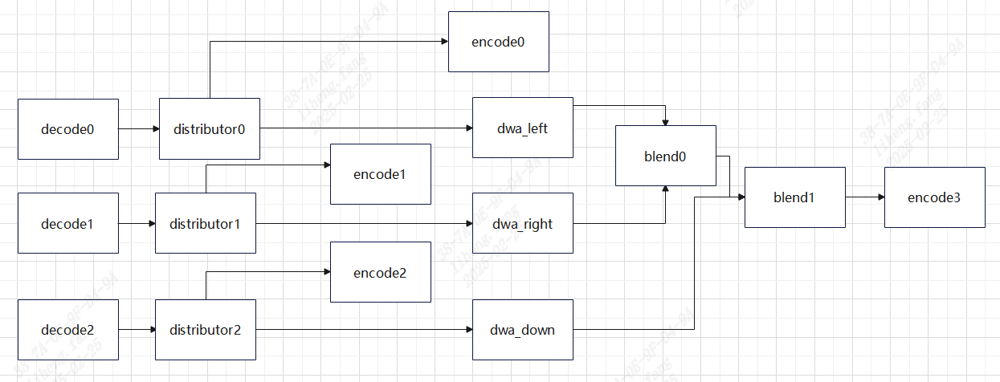
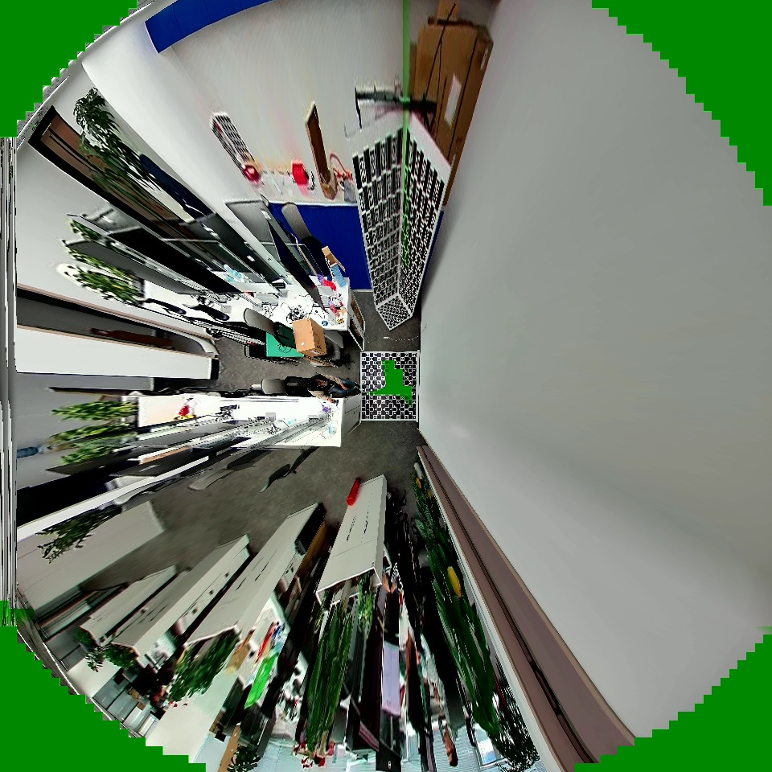

# trinocular_panorama_stitch Demo

## 目录
- [trinocular\_panorama\_stitch Demo](#trinocular_panorama_stitch-demo)
  - [目录](#目录)
  - [1. 简介](#1-简介)
  - [2. 特性](#2-特性)
  - [3. 准备数据](#3-准备数据)
  - [4. 环境准备](#4-环境准备)
    - [4. SoC平台](#4-soc平台)
  - [5. 程序编译](#5-程序编译)
    - [5.1 SoC平台](#51-soc平台)
  - [6. 程序运行](#6-程序运行)
    - [6.1 Json配置说明](#61-json配置说明)
    - [6.2 运行](#62-运行)

## 1. 简介

本例程用于说明如何使用sophon-stream快速构建三目全景拼接应用，并通过distributor额外引出三路原始流。流程图如下：


## 2. 特性

* 支持BM1688(SoC)
* 支持3路拼接

## 3. 准备数据

​在`scripts`目录下提供了相关数据的下载脚本 [download.sh](./scripts/download.sh)。

```bash
chmod -R +x scripts/
./scripts/download.sh
```

脚本执行完毕后，会在当前目录下生成`data`目录，其中包含`models`和`videos`两个子目录。
```bash
.
├── config  #配置文件
├── cpp
│   ├── CMakeLists.txt
│   └── main.cpp #独立于stream的三目拼接功能测试代码
├── datasets
│   ├── 0106 #三目摄像机对应的图
│   └── mask #用于blending的权重
├── gridinfo #各个摄像机对应的gridinfo，需要根据实际情况更换。
│   ├── down_grid_info_bev_90_90_4589_90_90_dst_2880x2880_src_2560x1440.1.dat
│   ├── left_grid_info_bev_90_90_5078_90_90_dst_2880x2880_src_2560x2160.1.dat
│   └── right_grid_info_bev_90_90_4233_90_90_dst_2880x2880_src_2560x1440.1.dat
└── README.md
```

## 4. 环境准备

### 4. SoC平台

如果您使用SoC平台（如SE、SM系列边缘设备），刷机后在`/opt/sophon/`下已经预装了相应的libsophon、sophon-opencv和sophon-ffmpeg运行库包，可直接使用它作为运行环境。通常还需要一台x86主机作为开发环境，用于交叉编译C++程序。
(1) 安装驱动
安装驱动需要进入到超级权限，接着系统驱动目录，安装驱动：

```bash
sudo -s
#请根据您实际使用的sensor安装相应驱动，这里只是示例：
insmod /mnt/system/ko/v4l2_pr2100.ko force_bus=1,1,1,1,-1,-1  force_i2caddr=0x5F,0x5F,0x5C,0x5C,0x5F,0x5F force_slave=0,0,1,1,0,0 
```

## 5. 程序编译

### 5.1 SoC平台
通常在x86主机上交叉编译程序，您需要在x86主机上使用SOPHON SDK搭建交叉编译环境，将程序所依赖的头文件和库文件打包至sophon_sdk_soc目录中，具体请参考[sophon-stream编译](../../docs/HowToMake.md)。本例程主要依赖libsophon、sophon-opencv和sophon-ffmpeg运行库包。

## 6. 程序运行

### 6.1 Json配置说明

dwa_blend_encode demo中各部分参数位于 [config](./config/) 目录，结构如下所示：

```bash
./config/
├── decode.json                 # 解码配置
├── engine.json                 # sophon-stream graph配置，需要分别配置dwa、blend、encode等文件
├── distributor_full_frame.json # distributor配置文件
├── encode.json                 # distributor后接的编码配置文件
├── camera.json                 # demo按图片文件夹输入的配置文件
├── dwa_L.json                  # 左侧输入的几何畸变矫正配置文件
├── dwa_R.json                  # 右侧输入的几何畸变矫正配置文件
├── dwa_D.json                  # 下侧输入的几何畸变矫正配置文件
├── blend_left_right.json        # 左右图拼接配置文件
├── blend_up_down.json           # 上下图拼接配置文件
└── encode_dwa.json              # blend后接的编码配置文件
```

其中，[camera.json](./config/camera.json)是例程的整体配置文件，管理输入码流等信息。在一张图上可以支持多路数据的输入，channels参数配置输入的路数，sample_interval设置跳帧数，loop_num设置循环播放次数，channel中包含码流url等信息。

### 6.2 运行

对于SoC平台，需将交叉编译生成的动态链接库、可执行文件、所需的模型和测试数据拷贝到SoC平台中测试。

SoC平台上，动态库、可执行文件、配置文件、模型、视频数据的目录结构关系应与原始sophon-stream仓库中的关系保持一致。

1. 参考[推流服务器使用方法](../../element/multimedia/encode/README.md#8-推流服务器)运行rtsp推流服务器。
   
2. 运行可执行文件， 如果使用sensor输入则需要运行`sudo -s`进入root环境，安装相关驱动，将--demo_config_path换成`config/camera_sensor.json`。
```bash
./main --demo_config_path=../samples/trinocular_panorama_stitch/config/camera.json
```
注：程序运行性能取决于dwa和blend插件的输入输出分辨率，使用本例程的配置和数据集的话，fps约等于12。

3. 通过VLC或其他方式拉取rtsp流。

拼接效果图：
